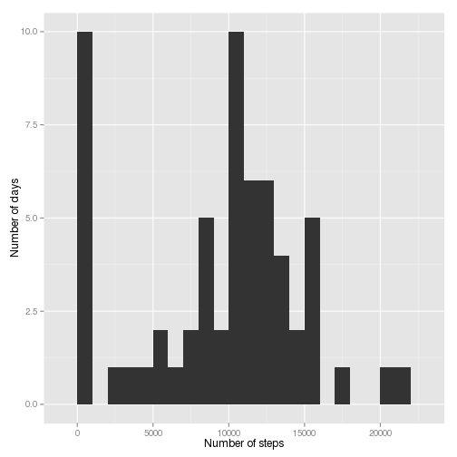
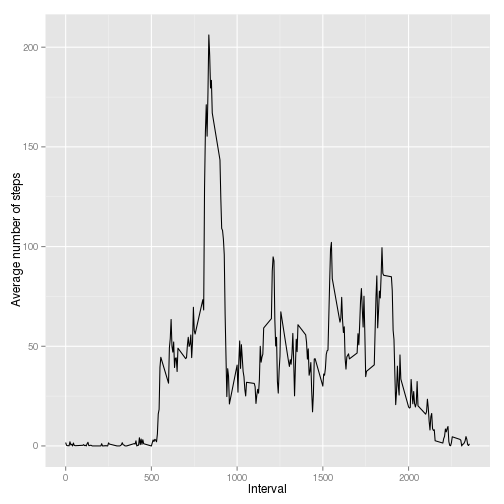
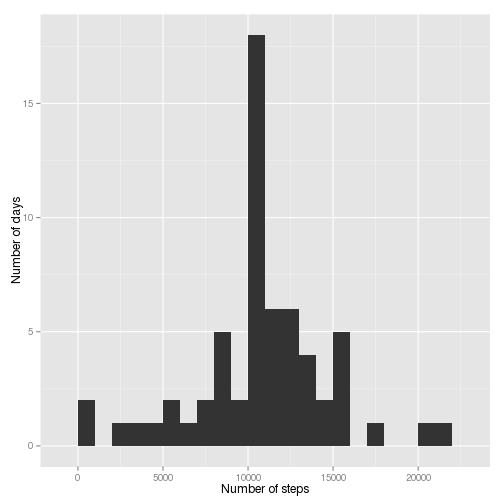
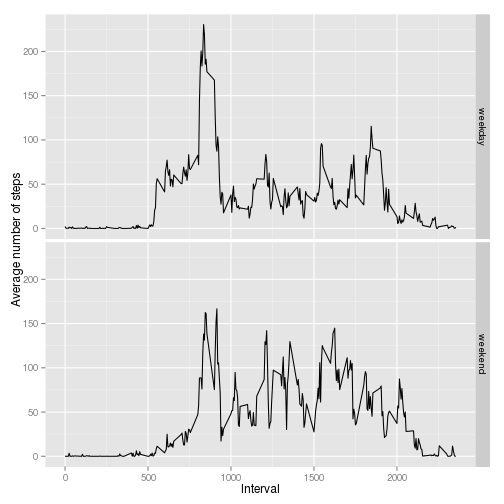

# Report for Assignment 1

This is the report for Assignment 1 of the Reproducible Research course
from the Data Science Specialization offered by Johns Hopkins University
at [Coursera](http://www.coursera.org/).

In this Assignment we'll take a look at data generated by a personal
activity monitoring device. This device collects data at 5-minute intervals
throughout the day. The data consists of two months of observations from an
anonymous individual collected during the months of October and November, 2012,
and include the number of steps taken in 5-minute intervals each day.

## Loading and preprocessing the data

We begin by setting the working directory,
unzipping the data file and reading it into R:

```r
setwd("/home/eduardo/datascience/coursera/5-repdata/RepData_PeerAssessment1")

zipfile <- "activity.zip"
datafile <- "activity.csv"

if (!file.exists(datafile)) {
    unzip(zipfile, overwrite = FALSE)
}

activity <- read.csv(datafile)
```

Let's take a look at the data:

```r
str(activity)
```

```
## 'data.frame':	17568 obs. of  3 variables:
##  $ steps   : int  NA NA NA NA NA NA NA NA NA NA ...
##  $ date    : Factor w/ 61 levels "2012-10-01","2012-10-02",..: 1 1 1 1 1 1 1 1 1 1 ...
##  $ interval: int  0 5 10 15 20 25 30 35 40 45 ...
```

```r
head(activity)
```

```
##   steps       date interval
## 1    NA 2012-10-01        0
## 2    NA 2012-10-01        5
## 3    NA 2012-10-01       10
## 4    NA 2012-10-01       15
## 5    NA 2012-10-01       20
## 6    NA 2012-10-01       25
```

```r
tail(activity)
```

```
##       steps       date interval
## 17563    NA 2012-11-30     2330
## 17564    NA 2012-11-30     2335
## 17565    NA 2012-11-30     2340
## 17566    NA 2012-11-30     2345
## 17567    NA 2012-11-30     2350
## 17568    NA 2012-11-30     2355
```

```r
summary(activity)
```

```
##      steps                date          interval     
##  Min.   :  0.00   2012-10-01:  288   Min.   :   0.0  
##  1st Qu.:  0.00   2012-10-02:  288   1st Qu.: 588.8  
##  Median :  0.00   2012-10-03:  288   Median :1177.5  
##  Mean   : 37.38   2012-10-04:  288   Mean   :1177.5  
##  3rd Qu.: 12.00   2012-10-05:  288   3rd Qu.:1766.2  
##  Max.   :806.00   2012-10-06:  288   Max.   :2355.0  
##  NA's   :2304     (Other)   :15840
```

Dates are stored as (character) factors.
To parse them as dates, we use the `ymd()` function
from the `lubridate` package:

```r
library("lubridate")
activity$date <- ymd(activity$date)
str(activity)
```

```
## 'data.frame':	17568 obs. of  3 variables:
##  $ steps   : int  NA NA NA NA NA NA NA NA NA NA ...
##  $ date    : POSIXct, format: "2012-10-01" "2012-10-01" ...
##  $ interval: int  0 5 10 15 20 25 30 35 40 45 ...
```

## What is mean total number of steps taken per day?

To compute the total number of steps taken every day,
we use the `dplyr` package to group the data according to day:

```r
library("dplyr")
```

```
## 
## Attaching package: 'dplyr'
## 
## The following objects are masked from 'package:lubridate':
## 
##     intersect, setdiff, union
## 
## The following objects are masked from 'package:stats':
## 
##     filter, lag
## 
## The following objects are masked from 'package:base':
## 
##     intersect, setdiff, setequal, union
```

```r
byday <- group_by(activity, date)
daily.sums <- summarise(byday, steps = sum(steps, na.rm = TRUE))
```

Note that `daily.sums` is a data frame with 61 observations
(that's the total number of days, 31 in October and 30 in November)
of two variables, `date` and `steps`:

```r
str(daily.sums)
```

```
## Classes 'tbl_df', 'tbl' and 'data.frame':	61 obs. of  2 variables:
##  $ date : POSIXct, format: "2012-10-01" "2012-10-02" ...
##  $ steps: int  0 126 11352 12116 13294 15420 11015 0 12811 9900 ...
##  - attr(*, "drop")= logi TRUE
```

Histogram of the number of steps taken each day:

```r
library("ggplot2")
bw <- 1000
lazydays <- sum(daily.sums$steps < bw)
qplot(steps, data = daily.sums, binwidth = bw,
      xlab = "Number of steps", ylab = "Number of days")
```

 

Here we have set the `binwidth` to be equal to 1000.
This means that every bar in the graph counts the number of days
where the total number of steps taken during the day
was between 0 and 1000, 1000 and 2000, 2000 and 3000, etc.

For instance, we learn that there are 10 days
when the total number of steps was between zero and 1000.

The mean and the median of the total number of steps taken each day
are easily computed:

```r
mean(daily.sums$steps, na.rm = TRUE)
```

```
## [1] 9354.23
```

```r
median(daily.sums$steps, na.rm = TRUE)
```

```
## [1] 10395
```

The fact that the median is significantly larger than the mean
is related to the absence of data for some days and intervals.
The option `na.rm = TRUE` strips all NAs from the data before
doing any computations.

## What is the average daily activity pattern?

To study the average daily activity pattern,
we group the data according to `interval` and compute the mean
of the number of steps taken for each interval across all 61 days.

```r
byinterval <- group_by(activity, interval)
int.steps <- summarise(byinterval, avstep = mean(steps, na.rm = TRUE))
```

Note that `int.steps` is a data frame containing 288 observations
(that's the total number of 5-minute intervals in any given day)
of two variables: `interval` and `avstep`:

```r
str(int.steps)
```

```
## Classes 'tbl_df', 'tbl' and 'data.frame':	288 obs. of  2 variables:
##  $ interval: int  0 5 10 15 20 25 30 35 40 45 ...
##  $ avstep  : num  1.717 0.3396 0.1321 0.1509 0.0755 ...
##  - attr(*, "drop")= logi TRUE
```

Let's plot this:

```r
qplot(interval, avstep, data = int.steps, geom = "path",
      xlab = "Interval", ylab = "Average number of steps")
```

 

From this plot we immediately learn that the average number of steps
remains close to zero before 5 am (interval 500) and drops very low again
after 9 pm (interval 2100), approximately.

The average number of steps in any 5-minute interval is, on average,
larger than 100 only during a brief period from 8 am to 9 am, approximately.

Now we locate the maximum of the average number of steps:

```r
maxrow <- which.max(int.steps$avstep)
```

This means that the maximum value in the `avstep` column
from the `int.steps` data frame occurs in row 104.
Now, which interval is that, and what's the value of the maximum?
Let's see:

```r
maxinterval <- int.steps[[maxrow, "interval"]]
maxvalue <- int.steps[[maxrow, "avstep"]]
```

The maximum average number of steps occurs in interval 835
and is equal to 206.1698113 steps.

## Inputting missing values

To locate and count the number of rows with missing values,
we use the `is.na()` function:

```r
missing <- is.na(activity$steps)
sum(missing)
```

```
## [1] 2304
```

We'll fill in the missing values with the mean for the corresponding interval
and save the result in a new data frame, `allactivity`.
The code chunk below goes through every row in the `activity` data frame,
replacing missing values with the corresponding average number of steps
for that interval from the `int.steps` data frame.

```r
allactivity <- activity
for (r in 1:17568) {
    if (missing[r]) {
        interval <- allactivity$interval[r]
        introw <- which(int.steps$interval == interval)
        allactivity$steps[r] <- int.steps$avstep[introw]
    }
}
```

There shouldn't be any NAs in `allactivity`:

```r
sum(is.na(allactivity$steps))
```

```
## [1] 0
```

Compute the total number of steps per day
(note that there's no need for the `na.rm = TRUE` option now):

```r
allbyday <- group_by(allactivity, date)
alldaily.sums <- summarise(allbyday, steps = sum(steps))
```

The `alldaily.sums` data frame contains 61 observations of two variables,
`date` and `steps`.

Histogram, mean and median for the dataset without any NAs:

```r
alllazydays <- sum(alldaily.sums$steps < bw)
qplot(steps, data = alldaily.sums, binwidth = bw,
      xlab = "Number of steps", ylab = "Number of days")
```

 

```r
mean(alldaily.sums$steps)
```

```
## [1] 10766.19
```

```r
median(alldaily.sums$steps)
```

```
## [1] 10766.19
```

Now there are only 2 days where the number of steps
was between zero and 1000.

Both the median and the mean increased, and now they coincide.

## Are there differences in activity patterns between weekdays and weekends?

It's easy to get the day of the week of a given date using `weekdays()`.
To classify that day as weekday or weekend, we create a function.
The `daycat` function below takes a vector of dates as input
(assumed to be in the "year-month-day" format) and returns
a vector with the character strings "weekday" or "weekend".

```r
daycat <- function(date) {                ## Expects year-month-day format
    
    library("lubridate")                  ## Load lubridate package
    
    sat <- weekdays(ymd("2015-07-18"))    ## "saturday", or local equivalent
    sun <- weekdays(ymd("2015-07-19"))    ## "sunday", or local equivalent
    
    wd <- weekdays(ymd(date))             ## Get weekdays for vector date
    is.weekend <- wd == sat | wd == sun   ## Logical; is it a weekend?
    
    n <- length(date)                     ## Get date vector's length
    dc <- vector(mode = "character",
                 length = n)              ## Initialize output vector
    
    dc[is.weekend] <- "weekend"           ## Fill weekends
    dc[!is.weekend] <- "weekday"          ## Fill weekdays
    dc                                    ## Return output vector
}
```

Let's add a column to `allactivity` indicating the type of the day:

```r
allactivity <- mutate(allactivity, daytype = daycat(date))
allactivity$daytype <- as.factor(allactivity$daytype)
```

We check our result:

```r
str(allactivity)
```

```
## 'data.frame':	17568 obs. of  4 variables:
##  $ steps   : num  1.717 0.3396 0.1321 0.1509 0.0755 ...
##  $ date    : POSIXct, format: "2012-10-01" "2012-10-01" ...
##  $ interval: int  0 5 10 15 20 25 30 35 40 45 ...
##  $ daytype : Factor w/ 2 levels "weekday","weekend": 1 1 1 1 1 1 1 1 1 1 ...
```

The `allactivity` data frame now contains an additional column, called
`daytype`, which is a factor with the levels `weekday` and `weekend`.

To study the average daily activity pattern split according to day type,
we group the data by `interval` and `daytype` and compute the mean
of the number of steps taken for each `interval` and `daytype`.

```r
allbyinterval <- group_by(allactivity, interval, daytype)
allint.steps <- summarise(allbyinterval, avstep = mean(steps))
```

Note that `allint.steps` is a data frame containing 576 observations
(that's twice the total number of 5-minute intervals in any given day)
of three variables: `interval`, `daytype`, and `avstep`:

```r
str(allint.steps)
```

```
## Classes 'grouped_df', 'tbl_df', 'tbl' and 'data.frame':	576 obs. of  3 variables:
##  $ interval: int  0 0 5 5 10 10 15 15 20 20 ...
##  $ daytype : Factor w/ 2 levels "weekday","weekend": 1 2 1 2 1 2 1 2 1 2 ...
##  $ avstep  : num  2.2512 0.2146 0.4453 0.0425 0.1732 ...
##  - attr(*, "vars")=List of 1
##   ..$ : symbol interval
##  - attr(*, "drop")= logi TRUE
```

```r
head(allint.steps)
```

```
## Source: local data frame [6 x 3]
## Groups: interval
## 
##   interval daytype     avstep
## 1        0 weekday 2.25115304
## 2        0 weekend 0.21462264
## 3        5 weekday 0.44528302
## 4        5 weekend 0.04245283
## 5       10 weekday 0.17316562
## 6       10 weekend 0.01650943
```

```r
tail(allint.steps)
```

```
## Source: local data frame [6 x 3]
## Groups: interval
## 
##   interval daytype     avstep
## 1     2345 weekday 0.26331237
## 2     2345 weekend 1.70518868
## 3     2350 weekday 0.29685535
## 4     2350 weekend 0.02830189
## 5     2355 weekday 1.41006289
## 6     2355 weekend 0.13443396
```

```r
summary(allint.steps)
```

```
##     interval         daytype        avstep       
##  Min.   :   0.0   weekday:288   Min.   :  0.000  
##  1st Qu.: 588.8   weekend:288   1st Qu.:  2.047  
##  Median :1177.5                 Median : 28.133  
##  Mean   :1177.5                 Mean   : 38.988  
##  3rd Qu.:1766.2                 3rd Qu.: 61.263  
##  Max.   :2355.0                 Max.   :230.378
```

Let's plot this:

```r
qplot(interval, avstep, data = allint.steps,
      facets = daytype ~ ., geom = "path",
      xlab = "Interval", ylab = "Average number of steps")
```

 

By using the `facets = daytype ~ .` option, we have created a one-column
graph with two rows, each corresponding to a different `daytype`.

Compared to weekdays, we see that weekends begin less abruptly and have,
on average, lower peak levels of activity (step count hardly ever exceeds 150).
